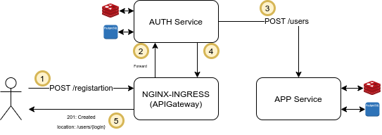
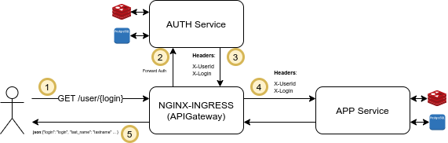
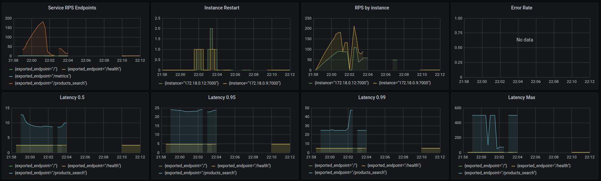
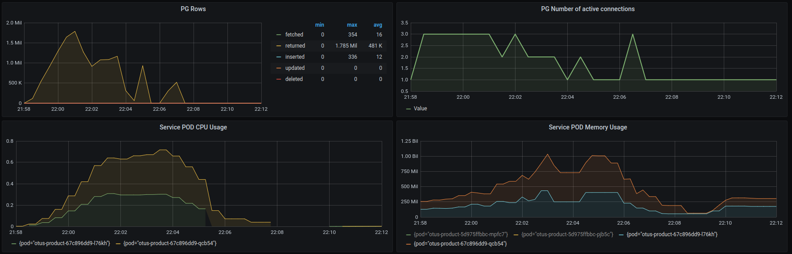
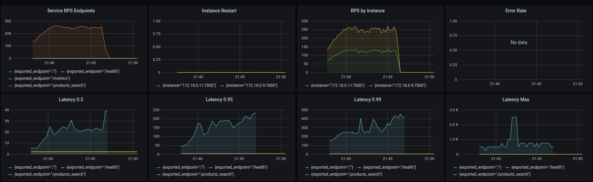
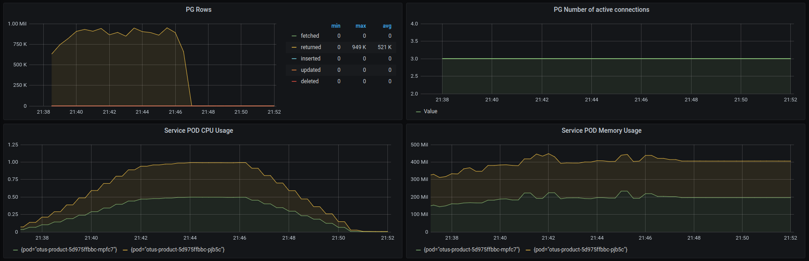
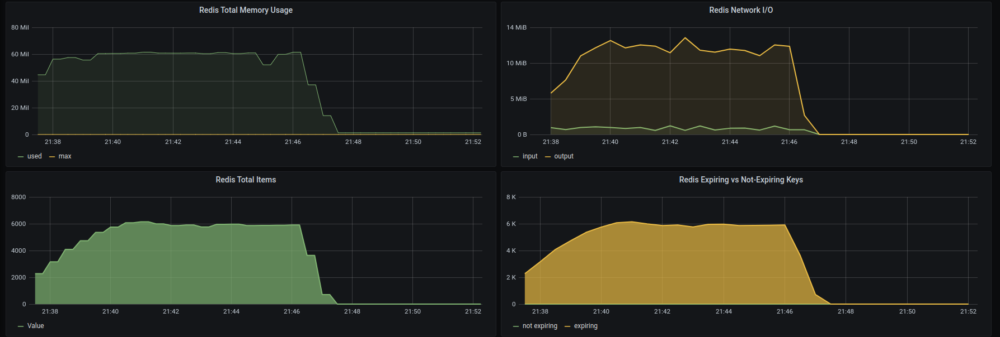
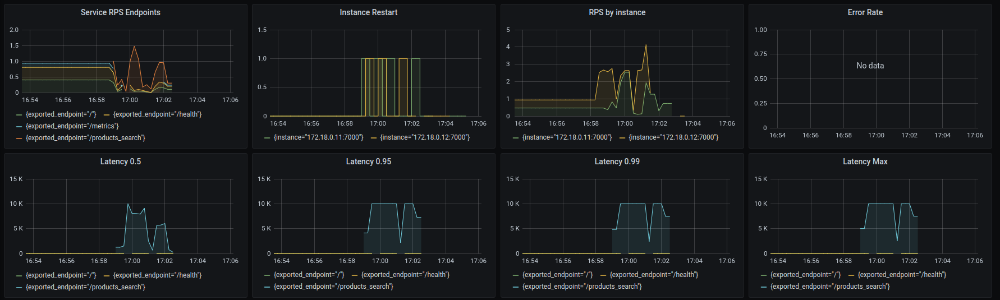
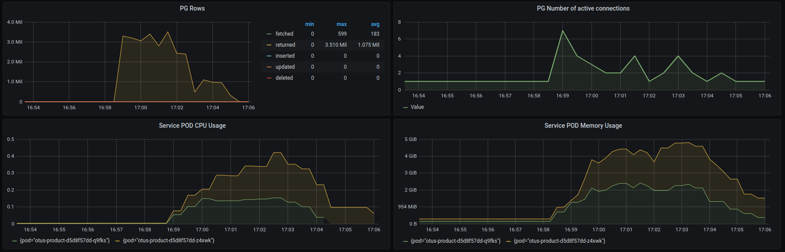
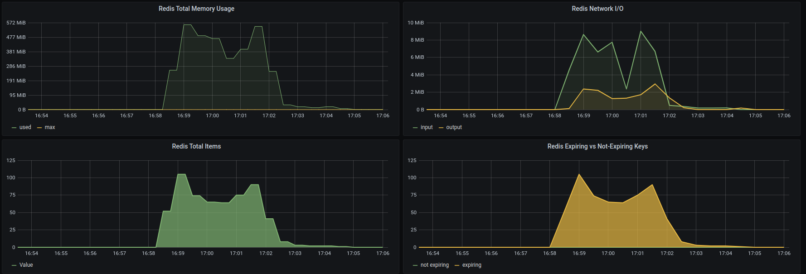

# Otus
Домашние задания по курсу [Архитектор ПО](https://otus.ru/lessons/arhitektor-po/?int_source=courses_catalog&int_term=operations)

## Первое домашнее задание
**tag**: v0.0.1 

Обернуть приложение в docker-образ и запушить его на Dockerhub
Создать минимальный сервис, который
1) отвечает на порту 8000
2) имеет http-метод
GET /health/
RESPONSE: {"status": "OK"}

Cобрать локально образ приложения в докер.
Запушить образ в dockerhub

На выходе необходимо предоставить
1) имя репозитория и тэг на Dockerhub
[jawello/otus:0.0.1](https://hub.docker.com/repository/docker/jawello/otus)
2) ссылку на github c Dockerfile, либо приложить Dockerfile в ДЗ

## Второе домашнее задание
**tag**: v0.0.2

Развернуть приложение в minikube

**Цель:** Написать манифесты для деплоя в k8s для сервиса из прошлого 
ДЗ. 
Манифесты должны описывать сущности Deployment, Service, Ingress. 
В Deployment обязательно должны быть указаны Liveness, Readiness пробы. 
Количество реплик должно быть не меньше 2. Image контейнера должен быть 
указан с Dockerhub. В Ingress-е должно быть правило, которое форвардит 
все запросы с /otusapp/* на сервис с rewrite-ом пути. Хост в ингрессе 
должен быть arch.homework. В итоге после применения манифестов GET 
запрос на http://arch.homework/otusapp/health должен отдавать
`{“status”: “OK”}`. На выходе предоставить ссылку на github c 
манифестами. 
Манифесты должны лежать в одной директории, так чтобы можно было их все 
применить одной командой kubectl apply -f .

## Третье домашнее задание
**tag**: v0.0.3

Добавить к развернутому приложению БД.
Сделать простейший RESTful CRUD по созданию, удалению, просмотру и 
обновлению пользователей.
Пример API - https://app.swaggerhub.com/apis/otus55/users/1.0.0

Добавить базу данных с persistent volume для приложения.
Docker-Image базы данных должен использоваться из официального 
докер-репозитория.
Под с БД должен запускаться StatefulSet-ом с количеством реплик - 1.
Конфигурация приложения должна хранится в Configmaps.
Доступы к БД должны храниться в Secrets.
Первоначальные миграции должны быть оформлены в качестве Pod-ы 
(или Job-ы).
Ingress-ы должны также вести на url arch.homework/otusapp/* 
(как и в прошлом занятии)

На выходе должны быть предоставлена
1) ссылка на директорию в github, где находится директория с манифестами
кубернетеса
2) команда kubectl apply -f, которая запускает в правильном порядке
манифесты кубернетеса.
3) Postman коллекция, в которой будут представлены примеры запросов к
сервису на создание, получение, изменение и удаление пользователя. 
Запросы из коллекции должны работать сразу после применения манифестов, 
без каких-то дополнительных подготовительных действий.

**tag**: v0.0.4

Задание со звездочкой (необязательное, но дает дополнительные баллы):
+3 балла за шаблонизацию приложения в helm 3 чартах
+2 балла за использование официального helm чарта для БД и подключение
его в чарт приложения в качестве зависимости.

## Четвертое домашнее задание
**tag**: v0.0.5

Инструментировать сервис метриками и алертами.
Инструментировать сервис из прошлого занятия метриками в формате 
Prometheus с помощью библиотеки для вашего фреймворка и ЯП.

Сделать дашборд в Графане, в котором были бы метрики с разбивкой по API 
методам:
1. Latency (response time) с квантилями по 0.5, 0.95, 0.99, max
2. RPS
3. Error Rate - количество 500ых ответов

Добавить в дашборд графики с метрикам в целом по сервису, взятые с 
nginx-ingress-controller:
1. Latency (response time) с квантилями по 0.5, 0.95, 0.99, max
2. RPS
3. Error Rate - количество 500ых ответов

Настроить алертинг в графане на Error Rate и Latency.

На выходе должно быть:
1) хелм чарт или директория с манифестами для запуска приложения с нуля.
В этой же директории должны быть servicemonitor-ы. В хелм чарт в 
качестве зависимостей не надо устанавливать nginx-ingress-controller и 
прометеус-оператор. Считаем, что они уже в кубике установлены.
В случае использования хелма без шаблонизации, отдельно про это написать
и указать команду установки через хелм и имя релиза.
2) в этой же директории dashboard.yaml - манифест с конфигмапом дашборды
для графаны, в формате, который умеет автоматически применять 
prometheus-operator
3) отдельно stresstest.yaml - манифсет с Job-ой, которая производит 
стабильную (не больше 20 и не меньше 5 рпс), нагрузку на все API методы,
в бесконечном цикле. Для нагрузки надо делать запросы на 
ingress-controller, передавая значение имени сервиса, на котором живет 
ингресс-контроллер в переменной окружения, и в случае использования helm
в качестве value-значения.
4) скриншоты дашборды в момент стресс-тестирования сервиса. Например,
после 5-10 минут нагрузки.


Задание со звездочкой (+5 баллов)
Инструментировать базу данных с помощью экспортера для prometheus для
этой БД.
Добавить в общий дашборд графики с метриками работы БД.

Используя существующие системные метрики из кубернетеса, добавить на 
дашборд графики с метриками:
1. Потребление подами приложения памяти
2. Потребление подами приолжения CPU

### Дополнение
Все команды выполняются из root'овой директории проекта.
#### Команда для установки prometheus
```bash
helm install prom stable/prometheus-operator -f prometheus/prometheus.yaml --atomic
```
#### Команда для установки nginx-controller
```bash
helm install nginx stable/nginx-ingress -f prometheus/nginx-ingress.yaml --atomic
```
#### Команда для добавления dashboard'а в grafan'у (имя dashboard'а "Service") 
```bash 
kubectl apply -f prometheus/grafana.yaml 
```
#### Команда для запуска стресс-теста
```bash
skaffold run -f stresstest.skaffold.yaml 
```
Параметры запуска stresstest'а находятся в stresstest-chart/values.yaml.
Это параметры для запуска 
[locust'а](https://docs.locust.io/en/stable/configuration.html) . 

## Пятое домашнее задания
**tag**: v0.0.6

Реализовать клиентскую аутентификацию и авторизацию с помощью apigateway.
Добавить в приложение аутентификацию и регистрацию пользователей.

Реализовать сценарий "Изменение и просмотр данных в профиле клиента".
Пользователь регистрируется. Заходит под собой и по определенному урлу 
получает данные о своем профиле. Может поменять данные в профиле. Данные
профиля для чтения и редактирования не должны быть доступны другим 
клиентам (аутентифицированным или нет).

На выходе должны быть
1. описание архитектурного решения и схема взаимодействия сервисов (в 
виде картинки)
1. команда установки приложения (из helm-а или из манифестов). 
Обязательно указать в каком namespace нужно устанавливать.
1. команда установки api-gateway, если он отличен от nginx-ingress.
1. тесты постмана, которые прогоняют сценарий:
    - регистрация пользователя 1
    - проверка, что изменение и получение профиля пользователя 
    недоступно без логина
    - вход пользователя 1
    - изменение профиля пользователя 1
    - проверка, что профиль поменялся
    - выход* (если есть)
    - регистрация пользователя 2
    - вход пользователя 2
    - проверка, что пользователь2 не имеет доступа на чтение и 
    редактирование профиля пользователя1.

В тестах обязательно
- наличие {{baseUrl}} для урла
- использование домена arch.homework в качестве initial значения 
{{baseUrl}}
- использование сгенерированных случайно данных в сценарии
- отображение данных запроса и данных ответа при запуске из командной 
строки с помощью newman.
### Архитектура
**Схема регистрации**



**Схема аутентификации**


### Дополнение
Все команды выполняются из root'овой директории проекта.
#### Команда для запуска приложения
```bash
skaffold run -f otus-app.skaffold.yaml
```
или
```bash
helm install otus-app otus-app/otus-app-chart  
```
#### Команда для запуска сервиса аутентификации
```bash
skaffold run -f otus-auth.skaffold.yaml  
```
или
```bash
helm install otus-auth otus-auth/otus-auth-chart  
```
#### Команды для добавления ingress'ов
```bash 
kubectl apply -f otus-auth/app-ingress.yaml 
kubectl apply -f otus-auth/auth-ingress.yaml           
```
#### Команда для запуска теста
```bash
newman run otus-auth/otus-app-auth.postman_collection.json
```
## Шестое домашнее задания
**tag**: v0.0.7

Реализовать один из паттернов кэширования в приложении.
Реализовать сервис "Продукты".
Сервис дает возможность искать по разным параметрам для продуктов и
выдает список подходящих под параметры запроса.

В рамках реализации сервиса сделать кэширование. Сделать возможность 
включить/отключение кэширование в приложении через переменную окружения 
(например, CACHE_ENABLED=1)

На выходе должно быть:
1) описание того, какой паттерн кэширования использовали
1) команда установки приложения (из helm-а или из манифестов). 
Обязательно указать в каком namespace нужно устанавливать и команду 
создания namespace, если это важно для сервиса.
1) тесты в postman

В тестах обязательно использование домена arch.homework в качестве 
initial значения {{baseUrl}}
### Дополнение
Для кэширования использовался Redis и библиотека aiohttp-cache, 
ключом кэширования является hash из method, host, path, postdata, ctype.
Для инвалидации cache'а используется TTL в 60 секунд.
В случае нехватки памяти вытеснение происходит по LFU (настроено в 
Redis).
#### Генерация данных
Для возможности тестирования можно сгенерировать данные. Для этого 
в [values.yaml](otus-product/otus-product-chart/values.yaml) нужно 
прописать блок *data_generation* (уже прописан), пример:
```yaml
data_generation:
  enabled: true
  image: jawello/otus-product-data-generator:0.0.7
  products_count: 100000 # кол-во генерируемых продуктов
  loglevel: WARNING
```
#### Команда для запуска приложения
```bash
skaffold run -f otus-product.skaffold.yaml
```
или
```bash
helm install otus-product otus-product/otus-product-chart  
```
#### Команда для запуска теста
```bash
newman run otus-product/otus-product.postman_collection.json
```
Тесты могут не пройти, если в бд не будет продуктов, которые содержат 
в имени слово "космос".
## Седьмое домашнее задания
**tag**: v0.0.8

Реализовать нагрузочное тестирование для приложения
Проведите нагрузочное тестирование сервиса "Продукты" одним из 
инструментов нагрузочного тестирования (например, JMeter, Yandex.Tank, 
Locust и т.д.).

Нагрузочный тест в течение не менее 10-15 минут.
В нагрузочном тесте постарайтесь использовать максимально правдоподобный
профиль нагрузки на сервис.

Сделайте выводы
- какая максимальная и рабочая нагрузка, которую выдерживает севрис
- какие есть узкие места в вашем приложении (упираетесь в БД, в память,
в CPU и т.д.)

Сравните две версии приложения - с включенным кэшированием и 
отключенным. Как отличаются их точки деградации, точки отказа? 
Какой вывод можно сделать?

На выходе необходимо предоставить отчет о проведении нагрузочного 
тестирования:
- опишите какой профиль нагрузки использовался для тестирования: 
запросы на статически урлы или сценарии (если сценарии, то какие)
- скриншоты с RPS/Latency/Error Rate во время проведения тестирования, 
отчеты из инструмента нагрузочного тестирования
- основные выводы


+5 баллов:
Провести объемное тестирование сервиса и показать как себя ведет сервис 
при рабочей нагрузке, но с разным объемом данных.

### Сценарий тестирования
#### Поиск товаров пользователем
1) Пользователь ищет товар 1ый товар
1) Если найдено больше 10 товаров, то пользователь добавляет еще 1о 
слово в поисковую строку (уточняет запрос) и делает запрос на поиск. 
Пользователь берет случайное слово из названия любого товара из выборки
1) Если товаров не найдено то пользователь делает поиск следующего 
товара
1) Возвращаемся к пункту (1) (каждый пользователь делает от 1 до 20 
циклов)
### Результаты тестирования
Можно сразу отметить, что тестирование лучше запускать на отдельной 
машине, т.к. в процессе тестирования locust сообщил, что процессор 
работает на максимальной загрузке и это может повлиять на возможность
создани максимальной нагрузки. Кроме того, создание нагрузки отнимало
ресурсы у тестируемой системы. 

Тестирование было запузено на 1000 пользователей, пользователь 
добавлялся каждые 5 секунд. Тестирование длилось в течении 10 минут.

Тестирование было запущено на БД, в которой случайным образом было
сгенерировано 10000 продуктов. 
#### Тестирование без кэширования
##### Prometheus dashboard




##### Locust results
[locust-results](loadtest-product/results-without-cache/locust-results.txt)
##### Выводы
Текущая архитектура сервиса явно не справляется с нагрузкой. Инстансы
в процессе тестирования перезапускались.  

Возможно увеличение кол-ва инстенсов сервиса позволит держать более 
высокую нагрузку. 

Узким местом стала реализация самих сервисов, каждый сервис использовал 
только 1о подключение к БД.

При высокой нагрузке БД явно очень долго отдавала данные. Поэтому можно
рассмотреть вариант с репликацией БД, для увеличения производительности
по чтению.

#### Тестирование с кэширования
##### Prometheus dashboard






##### Locust results
[locust-results](loadtest-product/results-cache/locust-results.txt)

##### Выводы
Кэширование позволило сервисам справится с нагрузкой и сильно снизить 
задержку ответа. Но все же стоит провести дополнительное тестирование
на сервис без кэширования для выявления узких мест и увеличиения 
производительности.
####  Объемное Тестирование с кэширования
В БД был добавлен 1 млн записей продуктов.  
##### Prometheus dashboard






##### Locust results
[locust-results](loadtest-product/results-volume/locust-results.txt)

##### Выводы
Сервис не справился с той же нагрузкой, с которой справлялся при 
небольшом объеме данных в БД. Это значит, что сервис не успевает 
обрабатывать приходящие запросы из-за долгого ответа БД. Это связано 
с тем, что поиск товаров осуществляется с помощью SQL оператора LIKE, 
который очень ресурсозатратный. 

#### Что можно сделать
Запрос на поиск товара подразумевает полнотекстовый поиск, а это значит,
что использование реляционной БД не очень подходит. Логичнее 
использовать готовые рещения для полнотекстового поиска: Sphinx, Elastic
Search. 

Если же остаться на реляционной БД, то стоит провести тестирование
с увеличенным кол-вом инстенсов сервиса. Так же стоит изучить 
реализацию сервиса, потому что странно, что сервис использует достаточно
мало подключений к БД.   
### Дополнение
Все команды выполняются из root'овой директории проекта.
#### Команда для установки prometheus
```bash
helm install prom stable/prometheus-operator -f prometheus/prometheus.yaml --atomic
```
#### Команда для установки nginx-controller
```bash
helm install nginx stable/nginx-ingress -f prometheus/nginx-ingress.yaml --atomic
```
#### Команда для добавления dashboard'а в grafan'у (имя dashboard'а "Service") 
```bash 
kubectl apply -f prometheus/grafana-product-dashboard.yaml 
```
#### Команда для проброса портов для grafana
```bash
port-forward service/prom-grafana 9000:80
```
#### Grafana credentials
user: admin
pas: prom-operator
#### Команда для запуска приложения
```bash
skaffold run -f otus-product.skaffold.yaml
```
или
```bash
helm install otus-product otus-product/otus-product-chart  
```
#### Команда для запуска нагрузочного тестирования
```bash
locust -f loadtest-product/src/app/locust-tasks/tasks.py --host=http://arch.homework --headless -u 1000 -r 5 -t 10m  
```
Для работы нагрузочного тестирования необходимо установить зависимости 
для питона:
[requrements.txt](loadtest-product/src/requirements.txt)